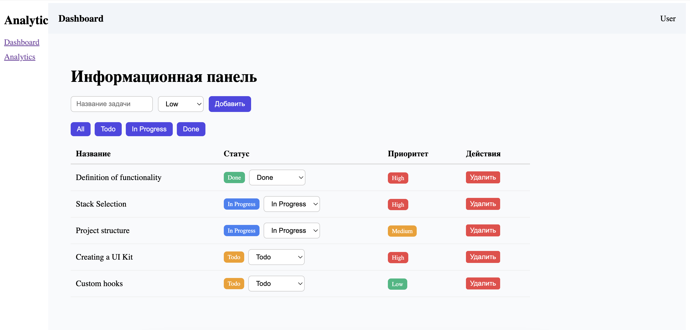

# 🚀 Analytic System

Dashboard-приложение для управления задачами с аналитикой и визуализацией данных.

---

## 🌐 Live Demo
👉 https://dashboard-cyan-eight-70.vercel.app

---

## 📸 Screenshots




---

## ✨ Features

- 📋 Создание и удаление задач
- 🔄 Изменение статуса (todo / in-progress / done)
- 🎯 Приоритет задач (low / medium / high)
- 🔍 Фильтрация задач
- 📄 Пагинация
- 📊 Аналитика с графиками (Chart.js)
- 💾 Persist (сохранение в localStorage)

---

## 🛠 Tech Stack

- React
- TypeScript
- Zustand (state management)
- React Router
- Chart.js
- CSS

---

## ⚙️ Installation

```bash
git clone https://github.com/taro4kaaaaa/Dashboard.git
cd Dashboard
npm install
npm run dev