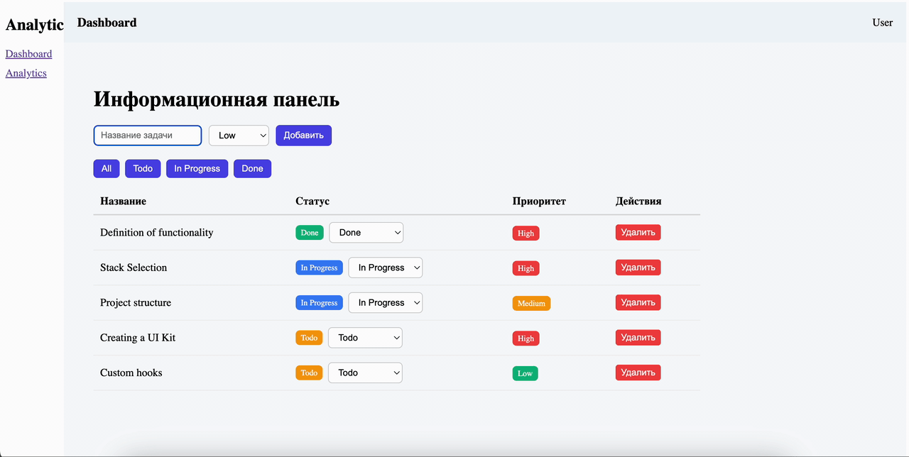
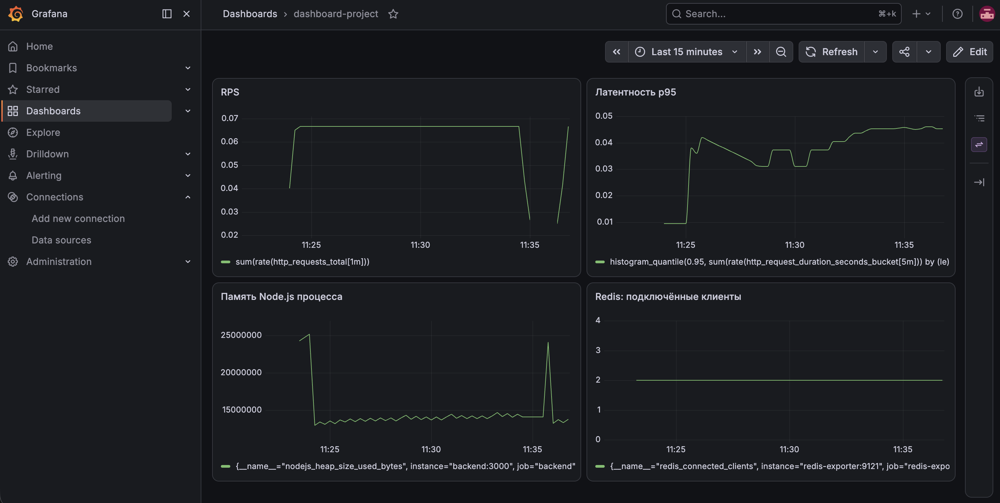

# 🚀 Dashboard — Infrastructure & Observability Project

Контейнеризированное клиент-серверное приложение, спроектированное как инфраструктурный pet-проект: multi-container оркестрация, CI-пайплайн и полноценный observability-стек (метрики, дашборды, алертинг).

Приложение (таск-менеджер) — прикладной слой, на котором демонстрируется инфраструктурная часть: Docker Compose, сетевое взаимодействие сервисов, CI/CD и мониторинг.

---

## 🌐 Live Demo

👉 https://dashboard-cyan-eight-70.vercel.app



---

## 🏗 Architecture

```text
┌──────────┐      ┌──────────────┐      ┌───────┐
│ Frontend │ ───▶ │ Backend API  │ ───▶ │ Redis │
│ (React)  │      │ (Node/Express)│      │       │
└──────────┘      └──────┬───────┘      └───────┘
                          │
                          │ /metrics
                          ▼
                   ┌─────────────┐
                   │ Prometheus  │◀────── node-exporter
                   └──────┬──────┘◀────── redis-exporter
                          │
              ┌───────────┴───────────┐
              ▼                       ▼
        ┌───────────┐          ┌─────────────┐
        │  Grafana  │          │ Alertmanager│
        └───────────┘          └─────────────┘
```

Вся инфраструктура поднимается одной командой через Docker Compose — 8 контейнеров, объединённых в единую сеть.

---

## 📦 Infrastructure Stack

```text
Orchestration   → Docker Compose (multi-container)
Metrics         → Prometheus
Visualization   → Grafana (Dashboard as Code)
Alerting        → Alertmanager
Exporters       → node-exporter, redis-exporter
Custom metrics  → prom-client (Express middleware)
CI              → GitHub Actions
```

---

## 📊 Observability

### Что собирается

| Источник | Метрики |
|---|---|
| Backend (custom) | `http_requests_total`, `http_request_duration_seconds` (RPS, латентность по методу/роуту/статус-коду) |
| Backend (default) | CPU, память, event loop lag, GC (Node.js runtime) |
| node-exporter | Метрики хоста (CPU, память, диск, сеть) |
| redis-exporter | Подключённые клиенты, использование памяти Redis |

### Dashboard

Дашборд в Grafana с ключевыми SLI сервиса:

- RPS
- Latency p95
- Node.js memory usage
- Redis connected clients

Конфигурация дашборда хранится как JSON в `monitoring/grafana/dashboards/` и провижинится автоматически при `docker compose up` — без ручного импорта через UI (Dashboard as Code).



### Alerting

Правила в `monitoring/alert.rules.yml`, обрабатываются Alertmanager:

| Alert | Условие |
|---|---|
| `BackendDown` | `up{job="backend"} == 0` дольше 1 минуты |
| `HighErrorRate` | доля 5xx-ответов выше 5% за 5 минут |

### Доступ к сервисам мониторинга

```text
Prometheus    → http://localhost:9090
Grafana       → http://localhost:3001   (admin / admin)
Alertmanager  → http://localhost:9093
```

---

## ⚙️ CI Pipeline

GitHub Actions запускается при каждом push:

```text
Git Push
    │
    ▼
GitHub Actions
    │
    ├── Frontend Build
    ├── Backend Validation
    └── Docker Image Build
```

Pipeline проверяет корректность сборки frontend, backend и Docker-образов перед деплоем.

---

## ✨ Application Features

Поверх инфраструктуры развёрнуто приложение управления задачами:

- Создание / изменение / удаление задач
- Изменение статуса и приоритета
- Аналитика: распределение задач по статусам и приоритетам
- REST API (`GET/POST/PATCH/DELETE /services`)
- Хранение состояния в Redis с автоинициализацией при старте

---

## 🛠 Tech Stack

**Infrastructure & DevOps**
Docker, Docker Compose, Prometheus, Grafana, Alertmanager, GitHub Actions, Linux

**Backend**
Node.js, Express, prom-client, Redis

**Frontend**
React, TypeScript, Zustand, React Router, Recharts

---

## 📂 Project Structure

```text
Dashboard/
├── frontend/
│   ├── src/
│   ├── Dockerfile
│   └── package.json
│
├── backend/
│   ├── src/
│   ├── Dockerfile
│   └── package.json
│
├── monitoring/
│   ├── prometheus.yml
│   ├── alert.rules.yml
│   ├── alertmanager.yml
│   ├── screenshots/
│   │   └── dashboard.png
│   └── grafana/
│       ├── provisioning/
│       │   └── dashboards/
│       │       └── dashboard.yml
│       └── dashboards/
│           └── dashboard-api-overview.json
│
├── .github/
│   └── workflows/
│       └── ci.yml
│
├── docker-compose.yml
└── README.md
```

---

## 🚀 Quick Start

```bash
git clone https://github.com/taro4kaaaaa/Dashboard.git
cd Dashboard
docker compose up --build
```

### Available Services

```text
Frontend      → http://localhost:5173
Backend API   → http://localhost:3000/services
Redis         → localhost:6379
Prometheus    → http://localhost:9090
Grafana       → http://localhost:3001
Alertmanager  → http://localhost:9093
```

### Stop

```bash
docker compose down
```

---


## 📈 DevOps Skills Demonstrated

- Docker & Docker Compose (multi-container orchestration)
- Observability: Prometheus + Grafana + Alertmanager
- Custom application metrics (prom-client, Express middleware)
- Dashboard as Code (версионируемые JSON-дашборды с автопровижинингом)
- Alerting rules (availability, error rate)
- GitHub Actions CI Pipeline
- REST API design
- Redis integration
- Linux-based development environment