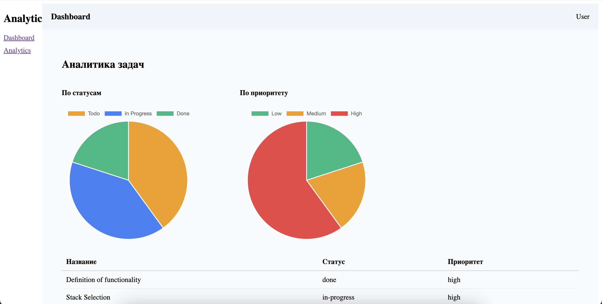

# 🚀 DevOps Dashboard

Контейнеризированное веб-приложение для управления инфраструктурными задачами и мониторинга сервисов.

Проект демонстрирует практические навыки работы с Docker, Docker Compose, Redis, GitHub Actions и построения CI-пайплайнов.

---

## 🌐 Live Demo

👉 https://dashboard-cyan-eight-70.vercel.app

---

## 📸 Screenshots

### 🏡 Dashboard


Управление задачами:

- создание задач
- изменение статуса
- изменение приоритета
- удаление задач
- синхронизация с backend API

---

### 📊 Analytics



Раздел аналитики содержит:

- распределение задач по статусам
- распределение задач по приоритетам
- визуализацию текущего состояния системы
- сводную статистику

---

## 🏗 Architecture

```text
Frontend (React)
        │
        ▼
Backend API (Node.js / Express)
        │
        ▼
Redis
```

Контейнеризированная инфраструктура:

```text
Docker Compose
├── frontend
├── backend
└── redis
```

---

## ✨ Features

### Task Management

- Create Task
- Delete Task
- Update Status
- Update Priority

### REST API

Backend реализует следующие endpoints:

```http
GET    /services
POST   /services
PATCH  /services/:id
DELETE /services/:id
```

### Redis Storage

Все задачи хранятся в Redis.

При старте приложения происходит автоматическая инициализация данных.

### Analytics

Визуализация:

- Todo Tasks
- In Progress Tasks
- Done Tasks
- Priority Distribution

### Containerization

Проект полностью контейнеризирован:

- Docker
- Docker Compose
- Multi-container architecture

---

## ⚙️ CI Pipeline

Настроен CI Pipeline на GitHub Actions.

При каждом push выполняется:

```text
Git Push
    │
    ▼
GitHub Actions
    │
    ├── Frontend Build
    ├── Backend Validation
    └── Docker Image Build
```

Pipeline автоматически проверяет:

- корректность сборки frontend
- корректность сборки backend
- успешную сборку Docker-образов

---

## 🛠 Tech Stack

### Frontend

- React
- TypeScript
- Zustand
- React Router
- Recharts
- CSS

### Backend

- Node.js
- Express

### Database & Cache

- Redis

### Infrastructure

- Docker
- Docker Compose

### CI/CD

- GitHub Actions

---

## 📂 Project Structure

```text
Dashboard/
├── frontend/
│   ├── src/
│   ├── Dockerfile
│   └── package.json
│
├── backend/
│   ├── src/
│   ├── Dockerfile
│   └── package.json
│
├── .github/
│   └── workflows/
│       └── ci.yml
│
├── docker-compose.yml
└── README.md
```

---

## 🚀 Quick Start

### Clone Repository

```bash
git clone https://github.com/taro4kaaaaa/Dashboard.git
cd Dashboard
```

### Run Application

```bash
docker compose up --build
```

### Available Services

```text
Frontend  → http://localhost:5173

Backend API → http://localhost:3000/services

Redis → localhost:6379
```

### Stop Containers

```bash
docker compose down
```

---

## 🔍 Redis Verification

Подключиться к Redis:

```bash
docker exec -it dashboard-redis-1 redis-cli
```

Посмотреть ключи:

```bash
KEYS *
```

Получить данные задач:

```bash
GET tasks
```

---

## 📈 DevOps Skills Demonstrated

- Docker Containerization
- Docker Compose Orchestration
- Redis Integration
- REST API Development
- Multi-Container Applications
- GitHub Actions CI Pipeline
- Automated Docker Image Validation
- Infrastructure-Oriented Application Architecture
- Client-Server Communication
- Linux-Based Development Environment

---

## 🔄 Current CI Workflow

Текущий pipeline автоматически запускается при каждом push в репозиторий и выполняет:

1. Frontend Build
2. Backend Validation
3. Docker Image Build
4. Build Verification

Это гарантирует, что приложение и контейнеры успешно собираются перед дальнейшим деплоем.

---
